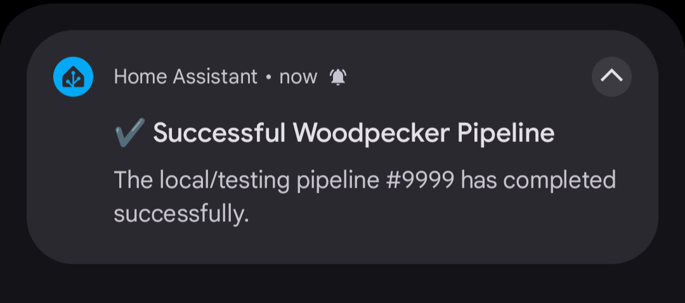
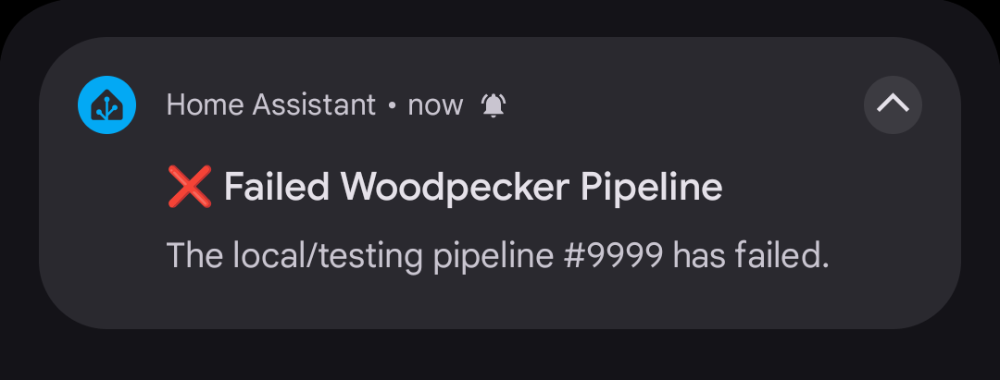

# Home Assistant Notify

Plugin to send notifications of pipeline status via Home Assistant.

## Settings

| Settings Name     | Required | Description                                                                                                                          |
|-------------------|----------|--------------------------------------------------------------------------------------------------------------------------------------|
| `host`            | **Yes**  | Home Assistant hostname and optional port without protocol                                                                           |
| `token`           | **Yes**  | A long-lived access token [[Official Documentation](https://developers.home-assistant.io/docs/auth_api/#long-lived-access-token)]    |
| `notify_id`       | **Yes**  | ID notify service to use. (Ex: `mobile_app_my_phone`) [[Official Documentation](https://www.home-assistant.io/integrations/notify/)] |
| `success_message` | No       | Optional. Message to display on success                                                                                              |
| `failure_message` | No       | Optional. Message to display on failure                                                                                              |
| `status`          | Depends  | Optional but required for Woodpecker >3.0 due to [woodpecker-ci/woodpecker#4337](https://github.com/woodpecker-ci/woodpecker/issues/4337). Workflow status override | 


## Usage

```yaml
steps:
  - name: Send Notification
    image: ghcr.io/dhandspikerwade/woodpecker-plugin-ha-notify:1
    settings:
      host:
        from_secret: homeassistant_host
      token:
        from_secret: homeassistant_token
      notify_id:
        from_secret: homeassistant_notify
      status: failure
    when:
      - status: [ failure ]
        event: [tag]
```

## Examples

### Successful Notification



### Failed Notification

